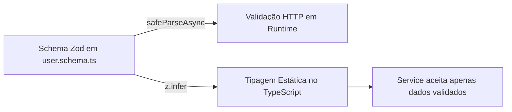

<!-- Documento: docs/12-guia-pratico-de-typescript.md -->

# 12 · Guia de TypeScript para Estudantes: Sintaxe, Exemplos e Aplicação no Projeto

[← Anterior](11-validacao-ponta-a-ponta.md) · [Índice](../README.md) · **Etapa 12 de 12** · [Registro de Validação](RELATORIO-DE-VALIDACAO.md)

Bem-vindo ao **Guia Prático de TypeScript**! Se você já programa em JavaScript ou está aprendendo backend, este capítulo foi feito sob medida para você. 

Aqui você vai aprender a **sintaxe do TypeScript passo a passo**, do básico ao avançado, com exemplos didáticos simples seguidos imediatamente pela demonstração de **onde e como essa sintaxe é usada dentro dos arquivos reais desta API**.

---

## 🧭 Mapa da Jornada

1. [O que é TypeScript e por que usamos?](#1-o-que-é-typescript-e-por-que-usamos)
2. [Tipos Primitivos e Inferência](#2-tipos-primitivos-e-inferência)
3. [Arrays e Objetos](#3-arrays-e-objetos)
4. [Interfaces e Type Aliases (Modelando Dados)](#4-interfaces-e-type-aliases-modelando-dados)
5. [Tipando Funções e Métodos](#5-tipando-funções-e-métodos)
6. [Unions e Tipos Literais (Muito além de Enums)](#6-unions-e-tipos-literais-muito-além-de-enums)
7. [Const Assertions (`as const`) e Type Assertions](#7-const-assertions-as-const-e-type-assertions)
8. [Generics `<T>` Descomplicados](#8-generics-t-descomplicados)
9. [Utility Types Essenciais (`Partial`, `ReturnType`, `Awaited`, etc.)](#9-utility-types-essenciais-partial-returntype-awaited-etc)
10. [`any` vs `unknown` e Type Narrowing (Programação Defensiva)](#10-any-vs-unknown-e-type-narrowing-programação-defensiva)
11. [Classes e Herança no TypeScript](#11-classes-e-herança-no-typescript)
12. [A Mágica do Zod: Inferindo Tipos em Tempo Real](#12-a-mágica-do-zod-inferindo-tipos-em-tempo-real)
13. [Cheatsheet: Guia Rápido de Sintaxe](#13-cheatsheet-guia-rápido-de-sintaxe)

---

## 1. O que é TypeScript e por que usamos?

No JavaScript puro, variáveis aceitam qualquer coisa e funções não avisam quais parâmetros esperam:

```javascript
// JavaScript tradicional:
function calcularDesconto(preco, cupom) {
  return preco - cupom.valor; // Se cupom for undefined, o servidor cai em tela preta!
}
```

O **TypeScript** é um *superconjunto* do JavaScript. Ele adiciona **tipagem estática** ao código. Isso significa que enquanto você escreve, o editor de código aponta erros antes mesmo de você salvar ou rodar o programa.

```typescript
// TypeScript:
interface Cupom {
  codigo: string;
  valor: number;
}

function calcularDesconto(preco: number, cupom?: Cupom): number {
  if (!cupom) return preco;
  return preco - cupom.valor; // O compilador garante que cupom.valor existe!
}
```

> **📌 Regra de Ouro:** O TypeScript funciona **apenas em tempo de desenvolvimento e compilação**. Quando rodamos `npm run build`, todo o TypeScript é transformado em JavaScript puro dentro de `dist/`. O Node.js executa JavaScript puro.

---

## 2. Tipos Primitivos e Inferência

### 2.1. A Sintaxe Básica
Para definir o tipo de uma variável, colocamos dois pontos (`:`) seguidos do tipo:

```typescript
const nome: string = 'Diogo';
const idade: number = 25;
const ativo: boolean = true;
const nulo: null = null;
const indefinido: undefined = undefined;
```

### 2.2. Inferência de Tipos (Deixe o TypeScript trabalhar por você)
Você **não precisa** tipar tudo manualmente. O TypeScript é inteligente e adivinha o tipo pelo valor inicial:

```typescript
// O TypeScript já sabe que 'porta' é number:
let porta = 3000; 
// porta = 'três mil'; // ❌ ERRO: Type 'string' is not assignable to type 'number'.
```

### 🔍 Onde isso está no projeto?
Em **`src/config/env.ts`**, usamos variáveis primitivas rigorosamente tipadas pelo ambiente:

```typescript
// Trecho de: src/config/env.ts
PORT: z.coerce.number().int().min(1).max(65535).default(3000),
JWT_SECRET: z.string().min(32),
```
Aqui o TypeScript sabe que qualquer código que importar `env.PORT` receberá obrigatoriamente um `number`, e `env.JWT_SECRET` será obrigatoriamente uma `string`.

---

## 3. Arrays e Objetos

### 3.1. Sintaxe de Arrays
Existem duas formas equivalentes de tipar listas no TypeScript:

```typescript
// Forma 1 (mais comum): tipo[]
const emails: string[] = ['admin@teste.com', 'user@teste.com'];
const codigos: number[] = [10, 20, 30];

// Forma 2 (genérica): Array<tipo>
const tags: Array<string> = ['node', 'typescript'];
```

### 3.2. Objetos com Propriedades Opcionais (`?`)
Por padrão, todo campo de um objeto tipado é obrigatório. Se um campo puder não existir, usamos a interrogação (`?`):

```typescript
// O campo 'sobrenome' é opcional:
const usuario: { nome: string; sobrenome?: string; idade: number } = {
  nome: 'Carlos',
  idade: 28,
  // sobrenome não é obrigatório aqui!
};
```

### 🔍 Onde isso está no projeto?
No serviço de usuários (**`src/services/user.service.ts`**), o nome do usuário não é obrigatório no cadastro:

```typescript
// Trecho de: src/services/user.service.ts
export interface CreateUserInput {
  email: string;     // Obrigatório
  password: string;  // Obrigatório
  name?: string;     // Opcional! Pode ser string ou undefined
}
```

---

## 4. Interfaces e Type Aliases (Modelando Dados)

Em vez de repetir a estrutura de um objeto toda vez que for usá-lo, criamos uma definição reutilizável com `interface` ou `type`.

### 4.1. Criando com `interface`
Usamos `interface` principalmente para descrever a forma de objetos:

```typescript
interface Cliente {
  idCliente: number;
  nomeCliente: string;
  emailCliente: string;
}

// Criando uma variável baseada na interface:
const novoCliente: Cliente = {
  idCliente: 1,
  nomeCliente: 'Padaria Central',
  emailCliente: 'contato@padaria.com',
};
```

### 4.2. Criando com `type` (Type Alias)
O `type` permite dar apelidos a qualquer tipo (objetos, uniões, primitivos, funções):

```typescript
type ID = number | string;
type StatusPedido = 'pendente' | 'pago' | 'cancelado';
```

### 4.3. Herança e Extensão
- **Com `interface` (usa `extends`):**
  ```typescript
  interface Pessoa {
    nome: string;
  }
  interface Funcionario extends Pessoa {
    salario: number; // Herda 'nome' e adiciona 'salario'
  }
  ```

- **Com `type` (usa interseção `&`):**
  ```typescript
  type Pessoa = { nome: string };
  type Funcionario = Pessoa & { salario: number };
  ```

### 🔍 Onde isso está no projeto?
Em **`src/services/cliente.service.ts`**, usamos `interface` para os dados de criação e `type` para atualização:

```typescript
// Trecho de: src/services/cliente.service.ts
export interface CreateClienteInput {
  nomeCliente: string;
  emailCliente: string;
}

// UpdateClienteInput aceita os mesmos campos, mas nenhum é obrigatório:
export type UpdateClienteInput = Partial<CreateClienteInput>;
```

---

## 5. Tipando Funções e Métodos

Toda função em TypeScript deve tipar seus **parâmetros de entrada** e, preferencialmente, seu **retorno**.

### 5.1. Sintaxe de Funções e Arrow Functions

```typescript
// Função tradicional:
function somar(a: number, b: number): number {
  return a + b;
}

// Arrow function:
const multiplicar = (x: number, y: number): number => {
  return x * y;
};

// Função que não devolve nada (void):
function registrarLog(mensagem: string): void {
  console.log(`[LOG]: ${mensagem}`);
}

// Função assíncrona (sempre retorna Promise<Tipo>):
async function buscarPreco(): Promise<number> {
  return 99.9;
}
```

### 5.2. Tipando Funções do Express (`RequestHandler`)
No Express, controladores e middlewares recebem `(req, res, next)`. No projeto, nós importamos os tipos prontos do Express:

```typescript
// Arquivo didático: exemplo de controlador
import type { Request, Response } from 'express';

export const olaMundo = (req: Request, res: Response): void => {
  res.json({ mensagem: 'Olá!' });
};
```

Para middlewares, a interface `RequestHandler` já tipa `req`, `res` e `next` de uma só vez:

```typescript
// Trecho de: src/middlewares/origin.middleware.ts
import type { RequestHandler } from 'express';

export const originGuard: RequestHandler = (req, res, next) => {
  // req, res e next já estão com os tipos corretos do Express automaticamente!
  const origin = req.get('origin');
  next();
};
```

---

## 6. Unions e Tipos Literais (Muito além de Enums)

No JavaScript tradicional, se quisermos limitar uma variável a valores específicos (como `"ativo"` ou `"inativo"`), costumamos torcer para que o usuário não digite `"abobrinha"`. No TypeScript, usamos **Tipos Literais e Uniões (`|`)**.

### 6.1. União de Tipos Simples (`|`)
Significa "este valor pode ser A **OU** B":

```typescript
let identificador: number | string;
identificador = 101;     // ✅ Válido
identificador = 'USR-99'; // ✅ Válido
// identificador = true; // ❌ ERRO: boolean não é permitido!
```

### 6.2. Tipos Literais (Valores Exatos como Tipos)

```typescript
type ModoAmbiente = 'development' | 'test' | 'production';

let modo: ModoAmbiente = 'development';
// modo = 'staging'; // ❌ ERRO: 'staging' não faz parte da lista permitida!
```

> **💡 Dica Pedagógica:** No TypeScript moderno, prefira união de literais (`'ativo' | 'inativo'`) em vez do clássico `enum`. Literais não geram código extra no JavaScript compilado e são muito mais limpos no JSON.

### 🔍 Onde isso está no projeto?
Em **`src/config/env.ts`**:

```typescript
// Trecho de: src/config/env.ts
NODE_ENV: z.enum(['development', 'test', 'production']).default('development')
```
E em **`src/middlewares/origin.middleware.ts`**:

```typescript
// Trecho de: src/middlewares/origin.middleware.ts
const unsafe = !['GET', 'HEAD', 'OPTIONS'].includes(req.method);
```

---

## 7. Const Assertions (`as const`) e Type Assertions

### 7.1. O que é `as const`?
Quando você declara um objeto, o TypeScript imagina que você poderá alterar os valores mais tarde, então ele infere tipos gerais (como `string` em vez de `'lax'`). Com `as const`, você congela os valores no nível de tipo:

```typescript
// Sem 'as const': o tipo de 'status' vira string geral:
const config1 = { status: 'ativo' }; 

// Com 'as const': o tipo de 'status' é estritamente o literal 'ativo' (e readonly!):
const config2 = { status: 'ativo' as const };
```

### 🔍 Onde isso está no projeto?
No arquivo **`src/controllers/auth.controller.ts`**:

```typescript
// Trecho de: src/controllers/auth.controller.ts
const cookieOptions = {
  httpOnly: true,
  secure: env.NODE_ENV === 'production',
  sameSite: 'lax' as const, // ← Se tirar o 'as const', o Express dá erro de tipo!
  path: '/',
};
```
O Express exige que `sameSite` seja exatamente `'lax' | 'strict' | 'none' | boolean`. Se deixássemos apenas `'lax'`, o TypeScript inferiria `string` genérica e rejeitaria o código.

---

## 8. Generics `<T>` Descomplicados

Pense em um **Generic** como uma **variável para tipos**. Em vez de fixar um tipo concreto, deixamos um espaço reservado que será preenchido quando a função ou classe for chamada.

### 8.1. Entendendo com um Exemplo Simples
Imagine uma caixa que guarda qualquer item:

```typescript
// T representa qualquer tipo que você quiser colocar na caixa:
interface Caixa<T> {
  conteudo: T;
}

const caixaDeTexto: Caixa<string> = { conteudo: 'Um livro' };
const caixaDeNumero: Caixa<number> = { conteudo: 42 };
```

### 8.2. Funções Genéricas

```typescript
// Retorna o primeiro elemento de qualquer array preservando o tipo original:
function pegarPrimeiro<T>(lista: T[]): T | undefined {
  return lista[0];
}

const primeiroNome = pegarPrimeiro(['Ana', 'Beto']); // Tipo retornado: string
const primeiroNumero = pegarPrimeiro([10, 20, 30]);   // Tipo retornado: number
```

### 🔍 Onde isso está no projeto?
Em **`src/prisma/db.ts`**, o cliente do Prisma 8 é genérico e recebe o contrato gerado pelo banco:

```typescript
// Trecho de: src/prisma/db.ts
import type { Contract } from './contract.js';

// db sabe exatamente quais tabelas existem porque passamos <Contract>:
export const db = postgres<Contract>({
  contractJson,
  url: env.DATABASE_URL,
});
```

E na validação de schemas em **`src/middlewares/validate.middleware.ts`**:

```typescript
// Recebe qualquer schema Zod (genérico):
export const validate = (schema: z.ZodType): RequestHandler => ...
```

---

## 9. Utility Types Essenciais (`Partial`, `ReturnType`, `Awaited`, etc.)

O TypeScript vem de fábrica com "funções para transformar tipos", chamadas de **Utility Types**. Eles evitam retrabalho.

### 9.1. `Partial<T>` (Tornar Tudo Opcional)
Pega um tipo e adiciona `?` em todos os campos:

```typescript
interface Usuario {
  nome: string;
  email: string;
}

// Todos os campos viram opcionais automaticamente:
type UsuarioEdicao = Partial<Usuario>;
// Equivalente a: { nome?: string; email?: string }
```

**🔍 No projeto:** Em `src/services/user.service.ts`:
```typescript
export interface CreateUserInput {
  email: string;
  password: string;
  name?: string;
}

// Na atualização, o usuário pode enviar apenas os campos que deseja mudar:
export type UpdateUserInput = Partial<CreateUserInput>;
```

---

### 9.2. `ReturnType<T>` e `Awaited<T>` (Extração Dinâmica de Tipos)
Essa é uma das técnicas mais inteligentes usadas no nosso projeto!

- **`ReturnType<typeof funcao>`:** Extrai o tipo do que a função retorna.
- **`Awaited<Promise<T>>`:** Remove a casca da Promise e pega o valor interno `T`.

**🔍 No projeto:** Em `src/services/user.service.ts`:
```typescript
// Descobre automaticamente o formato exato da linha do banco retornada pelo Prisma:
type UserRow = Awaited<ReturnType<typeof db.orm.public.User.create>>;
```

**Por que isso é incrível para o estudante?**
Você **nunca precisa escrever a interface da tabela na mão**! Se você adicionar uma coluna no banco e rodar `npm run contract:emit`, o `UserRow` se atualiza sozinho em todo o projeto.

---

### 9.3. `Pick<T, Keys>` e `Omit<T, Keys>`
- `Pick`: escolhe apenas certas propriedades.
- `Omit`: remove propriedades indesejadas.

```typescript
interface Produto {
  id: number;
  nome: string;
  custo: number; // Segredo comercial!
}

// Criando um tipo público sem o campo custo:
type ProdutoPublico = Omit<Produto, 'custo'>;
// Resultado: { id: number; nome: string }
```

---

## 10. `any` vs `unknown` e Type Narrowing (Programação Defensiva)

### 10.1. O Perigo do `any`
`any` desativa o TypeScript para aquela variável. **Evite usar `any`!** Ele esconde bugs e faz você perder todos os benefícios da linguagem:

```typescript
const dadoPerigoso: any = 'texto';
dadoPerigoso.metodoQueNaoExiste(); // Não dá erro no editor, mas QUEBRA em produção!
```

### 10.2. A Segurança do `unknown`
`unknown` significa: *"Eu não sei o que vem aqui ainda. O compilador não vai me deixar acessar nenhuma propriedade até que eu prove o que ela é"*.

```typescript
const valor: unknown = obterDadoExterno();

// valor.trim(); // ❌ ERRO: O TypeScript impede o acesso!

// Type Narrowing (afunilamento de tipo):
if (typeof valor === 'string') {
  console.log(valor.trim()); // ✅ Agora sim! O compilador sabe que é string.
}
```

### 🔍 Onde isso está no projeto?
No middleware de erros (**`src/middlewares/error.middleware.ts`**):

```typescript
// Trecho de: src/middlewares/error.middleware.ts
export const errorHandler: ErrorRequestHandler = (error: unknown, _req, res, next) => {
  
  // 1. Verificando se é uma instância da nossa classe HttpError:
  if (error instanceof HttpError) {
    res.status(error.status).json({ error: error.message });
    return;
  }

  // 2. Verificando propriedades de erro do banco de dados com segurança:
  if (typeof error === 'object' && error !== null && 'sqlState' in error && error.sqlState === '23505') {
    res.status(409).json({ error: 'Este e-mail já está em uso.' });
    return;
  }

  // 3. Fallback seguro:
  res.status(500).json({ error: 'Erro interno do servidor.' });
};
```

---

## 11. Classes e Herança no TypeScript

O TypeScript potencializa as classes do JavaScript com modificadores de acesso:
- `public`: acessível de qualquer lugar (padrão).
- `private`: acessível apenas dentro da própria classe.
- `readonly`: não pode ser alterado após o construtor.

### 11.1. Parameter Properties (Atalho do Construtor)
Em vez de declarar a propriedade e depois fazer `this.campo = campo`, o TypeScript faz tudo em uma linha dentro do construtor:

```typescript
class Livro {
  // Atalho: declara, recebe e atribui automaticamente:
  constructor(public readonly titulo: string, private paginas: number) {}
}
```

### 🔍 Onde isso está no projeto?
Em **`src/lib/http-error.ts`**:

```typescript
// Trecho de: src/lib/http-error.ts
export class HttpError extends Error {
  constructor(public readonly status: number, message: string) {
    super(message); // Passa a mensagem para a classe Error nativa do JS
  }
}
```
Com apenas 6 linhas de código:
1. Herda toda a funcionalidade de rastreio de pilha (`stack trace`) do `Error` nativo.
2. Adiciona o código de status HTTP (`400`, `401`, `404`, etc.) imutável (`readonly`).
3. Permite lançar erros expressivos: `throw new HttpError(404, 'Cliente não encontrado.');`.

---

## 12. A Mágica do Zod: Inferindo Tipos em Tempo Real

No backend moderno com TypeScript, nós não escrevemos interfaces repetidas para validar requisições. Nós usamos o **Zod** para validar em tempo de execução e pedimos para o TypeScript **inferir** os tipos automaticamente com `z.infer`.



### 🔍 Exemplo Real do Projeto
Em **`src/schemas/user.schema.ts`**:

```typescript
// 1. Criamos o schema Zod com as regras de validação:
export const createUserBody = z.object({
  name: z.string().trim().min(2).max(100).optional(),
  email: z.string().trim().toLowerCase().max(254).pipe(z.email()),
  password: z.string().min(8),
}).strict();

// 2. Extraímos o tipo TypeScript correspondente sem escrever nenhuma interface manual:
export type CreateUserDTO = z.infer<typeof createUserBody>;
```

Agora, o tipo `CreateUserDTO` é exatamente:
```typescript
type CreateUserDTO = {
  email: string;
  password: string;
  name?: string | undefined;
}
```

---

## 13. Cheatsheet: Guia Rápido de Sintaxe

Use esta tabela como consulta rápida enquanto desenvolve:

| O que você quer fazer? | Sintaxe em TypeScript | Exemplo no Projeto |
|---|---|---|
| Tipar variável básica | `let x: tipo = valor;` | `let token: string \| undefined;` ([auth.middleware.ts](../src/middlewares/auth.middleware.ts)) |
| Propriedade opcional | `campo?: tipo;` | `name?: string;` ([user.service.ts](../src/services/user.service.ts)) |
| Lista de itens | `tipo[]` ou `Array<tipo>` | `db.orm.public.User.all()` ([user.service.ts](../src/services/user.service.ts)) |
| Um valor OU outro | `tipoA \| tipoB` | `string \| number` |
| Fixar valor exato | `'a' \| 'b' \| 'c'` | `NODE_ENV: 'development' \| ...` ([env.ts](../src/config/env.ts)) |
| Congelar literal em objeto | `valor as const` | `sameSite: 'lax' as const` ([auth.controller.ts](../src/controllers/auth.controller.ts)) |
| Função assíncrona | `async (): Promise<T>` | `async function getUserById(id: number): Promise<User>` |
| Função do Express | `const fn: RequestHandler` | `export const originGuard: RequestHandler` ([origin.middleware.ts](../src/middlewares/origin.middleware.ts)) |
| Tornar tudo opcional | `Partial<Tipo>` | `UpdateUserInput = Partial<CreateUserInput>` ([user.service.ts](../src/services/user.service.ts)) |
| Extrair tipo do banco | `Awaited<ReturnType<typeof fn>>` | `type UserRow = Awaited<ReturnType<...>>` ([user.service.ts](../src/services/user.service.ts)) |
| Descobrir tipo do Zod | `z.infer<typeof schema>` | `type CreateUserDTO = z.infer<typeof createUserBody>` |
| Checar tipo com segurança | `if (x instanceof Classe)` | `if (error instanceof HttpError)` ([error.middleware.ts](../src/middlewares/error.middleware.ts)) |

---

## 🚀 Como treinar e conferir seu código

Sempre que estiver escrevendo código TypeScript nesta API, abra o terminal no diretório da API e execute:

```bat
REM No Windows (CMD ou PowerShell com npm.cmd):
npm.cmd run typecheck
```

- Se o terminal exibir `tsc --noEmit` sem nenhuma linha de erro, **seu código está 100% tipado e seguro!**
- Se houver algum erro, o TypeScript dirá exatamente o **arquivo, número da linha e o motivo** da incompatibilidade.

---

[← Voltar ao Capítulo 11 (Validação e Operação)](11-validacao-ponta-a-ponta.md) · [Índice Geral do Projeto](../README.md)
